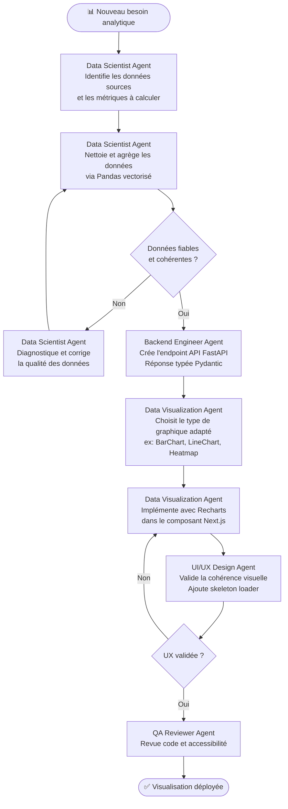

# Workflow Analytics - JobInsight AI

## Objectif
Ajouter une nouvelle analyse de données ou visualisation du marché de l'emploi, depuis la préparation des données jusqu'à l'affichage frontend.

## Agents impliqués
- **Data Scientist Agent** : Préparation et agrégation des données.
- **Backend Engineer Agent** : Exposition des données via un endpoint API.
- **Data Visualization Agent** : Conception et intégration du graphique.
- **UI/UX Design Agent** : Cohérence visuelle et états de chargement.

## Diagramme

## Checklist
- [ ] Sources de données identifiées (PostgreSQL / Pandas)
- [ ] Opérations Pandas vectorisées (pas de `iterrows`)
- [ ] Endpoint API typé avec Pydantic Response
- [ ] Type de graphique adapté aux données (max 6 couleurs)
- [ ] Skeleton loader défini pour l'état de chargement
- [ ] Tooltips et labels ARIA accessibles
- [ ] Mode sombre / clair validé
