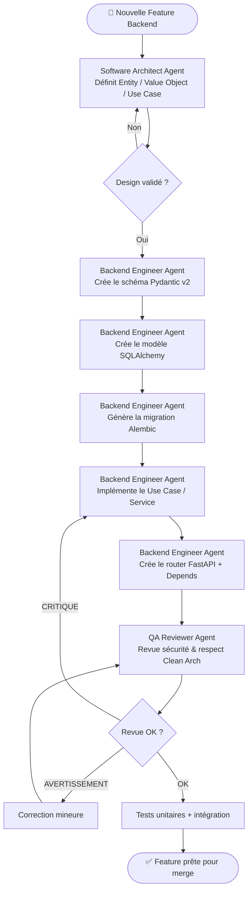

# Workflow Backend - JobInsight AI

## Objectif
Guider le développement d'une nouvelle fonctionnalité API de bout en bout, depuis la définition du domaine jusqu'à la mise en production.

## Agents impliqués
- **Software Architect Agent** : Validation du design et du domaine.
- **Backend Engineer Agent** : Implémentation FastAPI / SQLAlchemy.
- **QA Reviewer Agent** : Revue et tests avant merge.

## Diagramme

## Checklist
- [ ] Entity/Value Object définis dans `app/domain/`
- [ ] Use Case dans `app/application/`
- [ ] Schéma Pydantic Request/Response dans `app/schemas/`
- [ ] Modèle SQLAlchemy dans `app/models/`
- [ ] Migration Alembic générée et relue
- [ ] Router enregistré dans `app/api/`
- [ ] Tests écrits dans `tests/`
