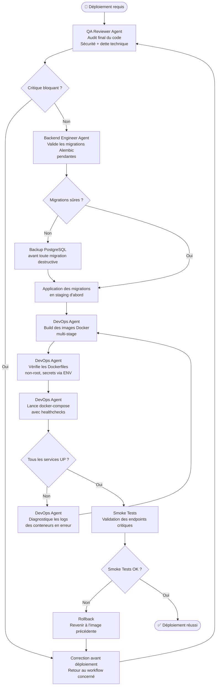

# Workflow Deployment - JobInsight AI

## Objectif
Garantir un déploiement sûr, reproductible et sans régression de JobInsight AI, de la validation locale à la mise en production via Docker.

## Agents impliqués
- **DevOps Agent** : Build Docker, orchestration et configuration des services.
- **QA Reviewer Agent** : Validation pre-deploy (sécurité, healthchecks).
- **Backend Engineer Agent** : Validation des migrations de base de données.

## Diagramme

## Checklist
- [ ] Revue QA sans critique bloquante
- [ ] Migrations Alembic relues et validées
- [ ] Backup PostgreSQL effectué si migrations destructives
- [ ] Images Docker buildées avec tag versionné (ex: `v1.2.0`)
- [ ] Secrets injectés via variables d'environnement (jamais hardcodés)
- [ ] Healthchecks configurés pour Postgres, Qdrant et API
- [ ] Smoke tests passés sur les endpoints critiques
- [ ] Plan de rollback documenté et testé
