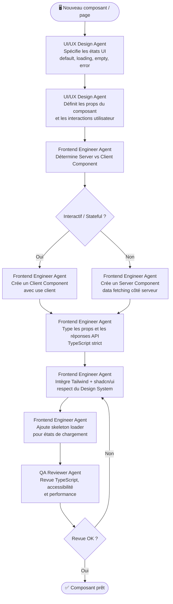

# Workflow Frontend - JobInsight AI

## Objectif
Développer un nouveau composant ou une nouvelle page dans l'interface Next.js, depuis la maquette jusqu'au composant typé et intégré.

## Agents impliqués
- **UI/UX Design Agent** : Conception et spécification du composant.
- **Frontend Engineer Agent** : Implémentation React / Next.js.
- **QA Reviewer Agent** : Revue du code et de l'accessibilité.

## Diagramme

## Checklist
- [ ] États UI spécifiés (default, loading, empty, error)
- [ ] Boundary Server/Client Component définie
- [ ] Props typées en TypeScript (no `any`)
- [ ] Skeleton loader implémenté
- [ ] Classes Tailwind uniquement (pas de CSS custom)
- [ ] Variables shadcn/ui utilisées pour les couleurs
- [ ] Responsive (mobile, tablet, desktop)
- [ ] ARIA labels sur les éléments interactifs
