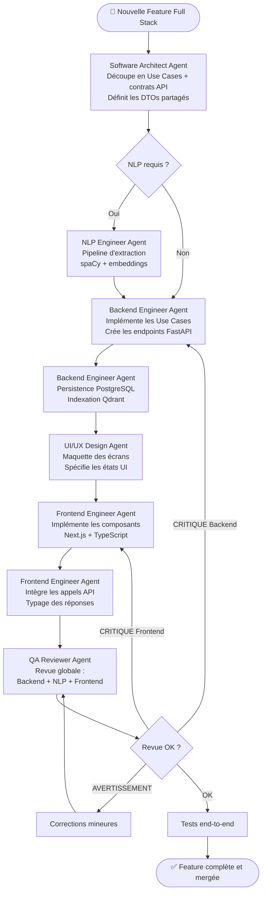

# Workflow Full Stack - JobInsight AI

## Objectif
Orchestrer le développement d'une fonctionnalité complète impliquant le domaine métier, l'API backend et l'interface utilisateur frontend, de manière cohérente et synchronisée.

## Agents impliqués
- **Software Architect Agent** : Design et découpage fonctionnel.
- **Backend Engineer Agent** : API, base de données, logique métier.
- **NLP Engineer Agent** : Pipeline NLP si extraction de texte requise.
- **Frontend Engineer Agent** : Composants et intégration API.
- **UI/UX Design Agent** : Expérience utilisateur et design.
- **QA Reviewer Agent** : Revue transversale avant merge.

## Diagramme

## Checklist
- [ ] Use Cases définis et validés par l'Architect
- [ ] Contrat API (schémas Pydantic) défini AVANT le code frontend
- [ ] Pipeline NLP intégré si requis
- [ ] Tests unitaires Backend écrits
- [ ] Composants Frontend typés
- [ ] Tests E2E couvrant le flux principal
- [ ] Revue QA passée sans critique bloquante
