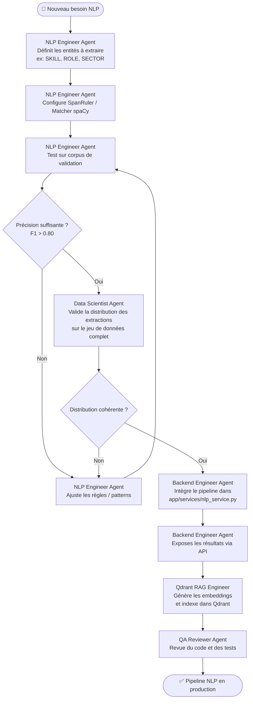

# Workflow NLP - JobInsight AI

## Objectif
Orchestrer l'ajout ou l'amélioration d'un composant de traitement du langage naturel, de l'extraction d'entités jusqu'à l'indexation vectorielle.

## Agents impliqués
- **NLP Engineer Agent** : Configuration spaCy et extraction des entités.
- **Data Scientist Agent** : Validation et évaluation de la qualité.
- **Backend Engineer Agent** : Intégration dans le service FastAPI.
- **Qdrant RAG Engineer (Skill)** : Indexation des vecteurs produits.

## Diagramme

## Checklist
- [ ] Entités cibles définies (noms en MAJUSCULES)
- [ ] Modèle spaCy chargé en Singleton dans `app/core/nlp.py`
- [ ] Composants inutilisés désactivés (`disable=[]`)
- [ ] Traitement en lot via `nlp.pipe()`
- [ ] F1 > 0.80 sur corpus de validation
- [ ] Service NLP intégré dans `app/services/`
- [ ] Vecteurs indexés dans Qdrant avec payload structuré
